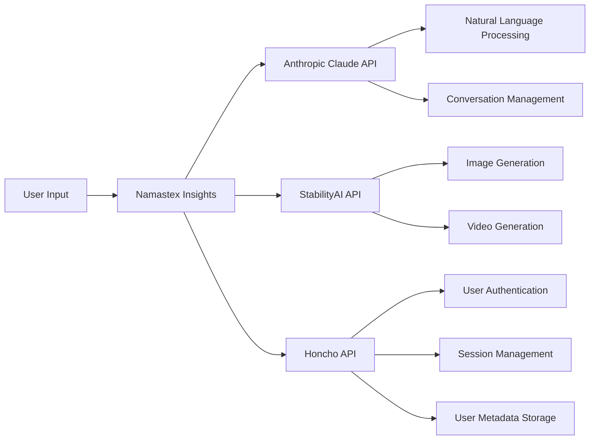

import { Callout, Steps, Step } from "nextra-theme-docs";

# API Integration

Namastex Insights seamlessly integrates with multiple external APIs to deliver its advanced functionalities. These APIs play a crucial role in enabling the bot to provide intelligent conversation, personalized interactions, and visually stunning content generation.

The key APIs integrated with Namastex Insights are:

- **Anthropic Claude API**: This API powers the natural language processing and conversation management capabilities of Namastex Insights. It allows the bot to understand user intents, generate contextually relevant responses, and maintain coherent conversations. Learn more about the Anthropic Claude API integration in the [Anthropic Claude API](/api-integration/anthropic-claude-api) section.

- **StabilityAI API**: Namastex Insights leverages the StabilityAI API for generating high-quality images and videos based on user prompts. This API enables the bot to create visually appealing content that enhances user engagement and interaction. Explore the details of the StabilityAI API integration in the [StabilityAI API](/api-integration/stabilityai-api) section.

- **Honcho API**: The Honcho API is integrated with Namastex Insights to handle user authentication, session management, and storing user metadata. It ensures secure access to the bot's features and allows for personalized experiences based on user preferences and historical interactions. Discover more about the Honcho API integration in the [Honcho API](/api-integration/honcho-api) section.

<Callout type="info">
  The seamless integration of these APIs enables Namastex Insights to provide a comprehensive and intelligent conversational experience within the Discord environment.
</Callout>

Here's a high-level overview of how these APIs work together in Namastex Insights:

By harnessing the power of these APIs, Namastex Insights can understand user intents, generate thoughtful responses, create stunning visual content, and provide personalized experiences based on user preferences and historical interactions.

<Steps>

### Step 1

Familiarize yourself with the APIs integrated into Namastex Insights. Understand their specific roles and capabilities in enabling the bot's functionalities.

### Step 2

Explore the dedicated sections for each API integration to gain a deeper understanding of how they are implemented and utilized within the Namastex Insights codebase.

### Step 3

Consider how you can leverage these API integrations to extend or customize Namastex Insights based on your specific requirements. Refer to the [Customization and Extension](/customization-and-extension) section for guidance.

</Steps>

The integration of these powerful APIs allows Namastex Insights to deliver an unparalleled conversational experience, combining intelligent dialogue, personalized interactions, and visually engaging content generation. As you dive deeper into each API integration, you'll discover the immense potential they bring to enhancing user engagement and satisfaction within your Discord community.