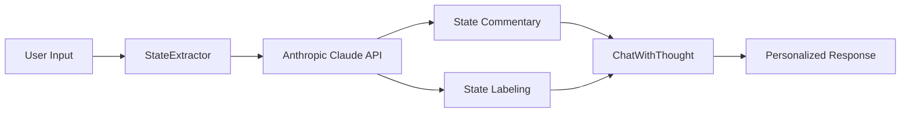

import { Callout, Steps, Step } from "nextra-theme-docs";

# Anthropic Claude API

Namastex Insights harnesses the power of Anthropic's Claude API for natural language processing and conversation management. The Claude API is a state-of-the-art language model that enables Namastex Insights to understand and respond to user inputs with exceptional accuracy and coherence.

## Key Features

The Claude API offers several key features that contribute to Namastex Insights' intelligent conversation capabilities:

- **Natural Language Understanding**: Claude excels at comprehending and interpreting user messages, allowing Namastex Insights to grasp the intent and context of user inputs accurately.

- **Contextual Awareness**: With its advanced context management capabilities, Claude enables Namastex Insights to maintain a coherent conversation flow by considering the entire chat history and user-specific context.

- **Engaging Responses**: Claude's language generation abilities allow Namastex Insights to provide thoughtful, relevant, and engaging responses that keep users interested and motivated to continue the conversation.

## Integration with Namastex Insights

The integration of the Anthropic Claude API within Namastex Insights is seamless and efficient. The `StateExtractor` class, defined in [`chain.py`](/customization-and-extension/modular-architecture), plays a crucial role in this integration.

The `StateExtractor` class utilizes the Claude API to perform the following tasks:

1. **State Commentary Generation**: By analyzing the user's chat history and current input, the Claude API generates insightful commentaries on the user's state, providing valuable context for personalized responses.

2. **State Labeling**: Based on the generated state commentary, the Claude API assigns appropriate labels to identify and categorize the user's current state, enabling Namastex Insights to adapt its responses accordingly.

<Callout type="info">
The Anthropic Claude API is a vital component of Namastex Insights' context management system, enabling the bot to understand and respond to users with remarkable precision and relevance.
</Callout>

## API Usage and Best Practices

To ensure optimal performance and responsible usage of the Anthropic Claude API, consider the following best practices:

- **API Key Management**: Keep your Anthropic API key secure and avoid sharing it publicly. Store it as an environment variable or in a secure configuration file.

- **Rate Limiting**: Be mindful of the API's rate limits and implement appropriate error handling and retry mechanisms to handle any rate-limiting issues gracefully.

- **Prompt Engineering**: Craft clear and concise prompts that provide sufficient context for the Claude API to generate accurate and relevant responses. Experiment with different prompt templates to find the most effective ones for your specific use case.

- **Handling Sensitive Information**: Implement necessary safeguards to prevent the disclosure of sensitive user information during interactions with the Claude API. Apply text filtering and masking techniques as needed.

By leveraging the power of the Anthropic Claude API, Namastex Insights delivers an unparalleled conversational experience, adapting to each user's unique needs and preferences. The seamless integration of this API within the modular architecture of Namastex Insights allows for easy customization and extension, enabling you to tailor the bot's behavior to your specific requirements.

For more information on customizing Namastex Insights and adding new features, refer to the [Customization and Extension](/customization-and-extension) section of this documentation.