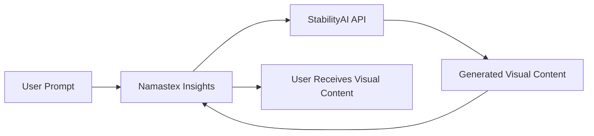

import { Callout, Steps, Step } from "nextra-theme-docs";

# StabilityAI API

Namastex Insights harnesses the power of [StabilityAI's API](/api-integration/stabilityai-api) to generate stunning visual content based on user prompts. This integration allows the bot to create captivating images and videos that enhance the user experience and foster creative collaboration within your Discord server.

## How It Works

The StabilityAI API utilizes advanced machine learning algorithms to generate high-quality images and videos from textual descriptions. When a user provides a prompt or objective, Namastex Insights communicates with the StabilityAI API to generate the requested visual content.

Here's a simplified overview of the process:

## Generating Images

To generate images using the StabilityAI API, Namastex Insights follows these steps:

<Steps>
### Step 1

The user provides a prompt or objective for the desired image using the `/generate` command.

### Step 2

Namastex Insights processes the user's input and constructs a request payload containing the necessary parameters, such as:
- Prompt
- Output format (e.g., JPEG, PNG)
- Image size
- Number of images to generate
- Refinement steps
- Configuration scale
- Sampling method

### Step 3

The bot sends a POST request to the StabilityAI API endpoint (`/v2beta/stable-image/generate/sd3`) with the constructed payload.

### Step 4

The StabilityAI API generates the requested images based on the provided parameters and returns the image data in the specified format.

### Step 5

Namastex Insights receives the generated images and processes them for display and storage. The images are saved in a project-specific folder and presented to the user for review and further interaction.
</Steps>

## Video Generation

In addition to image generation, Namastex Insights also supports video generation using the StabilityAI API. The process is similar to image generation, with a few additional steps:

<Steps>
### Step 1

After generating a set of images, the user can select a specific image to use as the basis for video generation.

### Step 2

Namastex Insights prompts the user for additional parameters required for video generation, such as:
- Seed value
- Configuration scale
- Motion bucket ID

### Step 3

The bot constructs a request payload with the selected image and video generation parameters and sends a POST request to the StabilityAI API endpoint (`/v2beta/image-to-video`).

### Step 4

The StabilityAI API generates the requested video based on the provided image and parameters. This process may take some time, depending on the complexity of the video.

### Step 5

Namastex Insights periodically checks the status of the video generation task by sending GET requests to the `/v2beta/image-to-video/result/{generation_id}` endpoint.

### Step 6

Once the video generation is complete, Namastex Insights retrieves the video data and saves it in the project-specific folder. The user is then notified that the video is ready for viewing.
</Steps>

<Callout type="info">
The StabilityAI API supports various parameters that allow users to customize and fine-tune the generated visual content. Namastex Insights exposes these parameters through intuitive prompts and interactions, enabling users to achieve their desired results.
</Callout>

By leveraging the StabilityAI API, Namastex Insights brings the power of AI-driven visual content generation directly into your Discord server. Whether you're brainstorming ideas, creating engaging visuals for discussions, or simply exploring creative possibilities, Namastex Insights and the StabilityAI API provide a seamless and immersive experience.