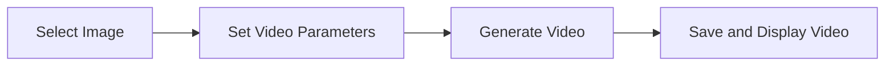

import { Callout, Steps, Step } from "nextra-theme-docs";

# Art Generation

Namastex Insights takes Discord bot capabilities to the next level with its powerful art generation feature. By seamlessly integrating with the StabilityAI API, Namastex Insights allows users to generate stunning visual content directly within their Discord server.

## How It Works

The art generation process in Namastex Insights is orchestrated by the `art_maestro.py` file. It consists of three main functions:

1. `opus_orchestrator`: Breaks down the user's objective into manageable sub-tasks.
2. `haiku_sub_agent`: Executes each sub-task and generates images using the StabilityAI API.
3. `opus_refine`: Combines the sub-task results into a cohesive final output.

These functions work together to create a seamless art generation experience for users.

<Steps>

### Step 1: User Initiates Art Generation

To generate art, users can invoke the `/generate` slash command within a Discord channel. They provide an objective or prompt describing the desired visual content.

### Step 2: Objective Breakdown

Upon receiving the user's objective, the `opus_orchestrator` function breaks it down into smaller sub-tasks. This breakdown ensures that each sub-task is focused and manageable.

### Step 3: Sub-Task Execution

The `haiku_sub_agent` function takes each sub-task and generates corresponding images using the StabilityAI API. It sends a POST request to the API endpoint with the necessary parameters, such as the prompt, output format, seed, steps, configuration scale, and sampler.

### Step 4: User Feedback and Refinement

After generating the initial set of images, Namastex Insights presents them to the user for feedback. The user can provide input on how to improve the generated images, which is then incorporated into the next iteration of the art generation process.

### Step 5: Final Output

Once the user is satisfied with the generated images, the `opus_refine` function combines the sub-task results into a final, cohesive output. This output may include additional refinements and adjustments based on user feedback.

</Steps>

## Customization Options

Namastex Insights offers a range of customization options for art generation, allowing users to fine-tune the results according to their preferences. Some of the key parameters users can control include:

- **Image Count**: The number of images to generate for a given objective.
- **Image Size**: The dimensions of the generated images (e.g., 256x256, 512x512).
- **Refinement Steps**: The number of iterative refinement steps to apply during the generation process.
- **Configuration Scale**: A value that influences the randomness and variability of the generated images.
- **Sampling Method**: The algorithm used for sampling the latent space during image generation.

<Callout type="info">
Namastex Insights provides a user-friendly interface for setting these parameters, making it easy for users to customize the art generation process to their liking.
</Callout>

## Video Generation

In addition to generating static images, Namastex Insights also supports video generation. Users can select a generated image and use it as a starting point for creating a short video.

The video generation process involves the following steps:

By leveraging the capabilities of the StabilityAI API, Namastex Insights enables users to create dynamic and engaging visual content within their Discord communities.

## Folder Structure

Namastex Insights automatically organizes the generated files and folders using the `create_folder_structure` function. This function takes the project name, folder structure (as a JSON object), and code blocks as input, and recursively creates the necessary folders and files based on the provided structure.

The resulting folder structure ensures that the generated content is easily accessible and well-organized, making it convenient for users to manage and share their creations.

## Conclusion

The art generation feature of Namastex Insights empowers Discord users to unleash their creativity and engage with their communities in new and exciting ways. By combining the power of AI, seamless API integration, and user-friendly customization options, Namastex Insights sets a new standard for visual content creation within Discord.

Whether you're an artist looking to showcase your work, a community manager seeking to engage your members, or simply someone who appreciates the beauty of AI-generated art, Namastex Insights has you covered. Get ready to embark on a thrilling journey of artistic exploration and collaboration with Namastex Insights!

For more information on related topics, check out the following sections:

- [AI-Powered Personalization](/core-features/ai-powered-personalization)
- [Context Management](/core-features/context-management)
- [Intelligent Conversation](/core-features/intelligent-conversation)
- [StabilityAI API Integration](/api-integration/stabilityai-api)