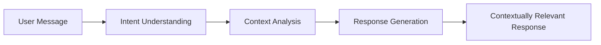

import { Callout, Steps, Step } from "nextra-theme-docs";

# Intelligent Conversation

Namastex Insights takes Discord conversations to a whole new level with its advanced AI-powered intelligent conversation capabilities. By leveraging state-of-the-art natural language processing techniques and machine learning algorithms, Namastex Insights engages users in thoughtful, coherent, and contextually relevant discussions.

## Understanding User Intent

At the core of Namastex Insights' intelligent conversation system is its ability to understand and interpret user intent. The bot analyzes each user message, considering factors such as:

- The semantic meaning of the message
- The context of the ongoing conversation
- The user's previous interactions and preferences

By comprehending the user's intent, Namastex Insights can provide responses that are not only relevant but also aligned with the user's expectations and needs.

<Callout type="info">
Namastex Insights' intent understanding capabilities are powered by the [StateExtractor](/core-features/context-management#stateextractor-class) class, which utilizes advanced NLP techniques to extract meaningful insights from user messages.
</Callout>

## Generating Contextually Relevant Responses

Once Namastex Insights understands the user's intent, it employs the [ChatWithThought](/core-features/context-management#chatwiththought-module) module to generate thoughtful and contextually relevant responses. This module considers various factors, such as:

- The user's current state and context
- The topic of the conversation
- The user's preferences and interaction history

By synthesizing these elements, Namastex Insights crafts responses that maintain a natural flow and coherence throughout the conversation. The bot's responses are designed to engage users, provide valuable information, and foster meaningful interactions.

Here's a simplified diagram illustrating the response generation process:

## Continuous Improvement through Few-Shot Learning

Namastex Insights doesn't rely on static, pre-trained models for its intelligent conversation capabilities. Instead, it employs few-shot learning techniques to continuously improve its performance based on real-time user interactions.

<Steps>
### Step 1: Collect User Feedback

As users interact with Namastex Insights, the bot collects valuable feedback and examples of successful conversations. This feedback serves as training data for the few-shot learning process.

### Step 2: Optimize the Chat Module

The [BootstrapFewShot](/core-features/context-management#few-shot-learning) optimizer utilizes the collected feedback and examples to fine-tune the chat module's parameters. By iteratively refining the module's performance, the optimizer ensures that Namastex Insights adapts and improves over time.

### Step 3: Evaluate Response Quality

The [response_metric](/core-features/context-management#response-metric) function assesses the quality and relevance of generated responses using advanced language models like GPT-4. This evaluation helps identify areas for further improvement and guides the optimization process.

### Step 4: Deploy the Optimized Model

Once the chat module has been optimized, the updated model is deployed to provide enhanced conversation capabilities to users. This continuous improvement cycle ensures that Namastex Insights remains at the forefront of intelligent conversation technology.
</Steps>

## Real-World Examples

To illustrate the power of Namastex Insights' intelligent conversation capabilities, let's consider a few real-world examples:

1. **Personalized Recommendations**: When a user asks for movie recommendations, Namastex Insights analyzes their previous interactions and preferences to suggest movies that align with their tastes. For instance:

   > User: Can you recommend some good sci-fi movies?
   > 
   > Namastex Insights: Based on your interest in thought-provoking and visually stunning sci-fi, I recommend:
   > - Inception (2010)
   > - Ex Machina (2014)
   > - Arrival (2016)
   > These movies explore complex themes and feature compelling performances. Let me know if you'd like more recommendations!

2. **Contextual Assistance**: Namastex Insights can provide contextually relevant assistance based on the user's current needs. For example:

   > User: I'm trying to learn Python programming. Where should I start?
   >
   > Namastex Insights: Learning Python is a great choice! Here are some resources to get you started:
   > - The official Python documentation: [https://docs.python.org/](https://docs.python.org/)
   > - Python Crash Course book: [https://nostarch.com/pythoncrashcourse2e](https://nostarch.com/pythoncrashcourse2e)
   > - Codecademy's Python course: [https://www.codecademy.com/learn/learn-python](https://www.codecademy.com/learn/learn-python)
   > Remember to practice coding regularly and work on projects to reinforce your learning. Feel free to ask if you have any specific questions along the way!

These examples showcase how Namastex Insights engages users in intelligent, contextually relevant conversations, providing personalized recommendations and assistance based on their unique needs and preferences.

## Conclusion

Namastex Insights' intelligent conversation capabilities revolutionize the way users interact with Discord bots. By understanding user intent, generating contextually relevant responses, and continuously improving through few-shot learning, Namastex Insights delivers engaging, meaningful, and personalized conversations.

As you explore the power of Namastex Insights, you'll discover a bot that truly understands and adapts to your needs, elevating your Discord experience to new heights. Get ready to embark on a journey of intelligent, contextually aware conversations that will transform the way you communicate and collaborate within your Discord communities.