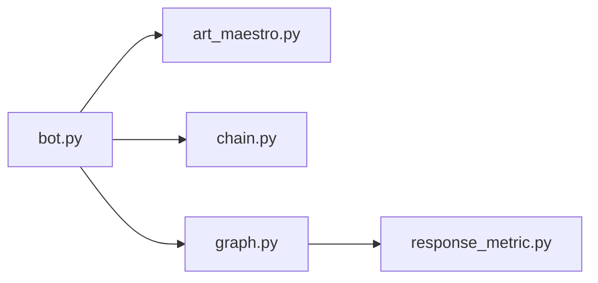

import { Callout, Steps, Step } from "nextra-theme-docs";

# Modular Architecture

Namastex Insights boasts a highly modular and extensible architecture, making it easy for developers to customize and extend its functionality to fit their specific needs. The codebase is structured into distinct files, each serving a specific purpose and encapsulating related functionality. This modular design promotes code reusability, maintainability, and scalability.

Let's take a closer look at the key components of Namastex Insights' modular architecture:

## Core Modules

The core modules of Namastex Insights are:

- **`art_maestro.py`**: This module orchestrates the art generation process, handling sub-task breakdown, execution, and refinement. It provides functions like `opus_orchestrator`, `haiku_sub_agent`, and `opus_refine` to manage the entire art generation workflow.

- **`bot.py`**: Serving as the main entry point, this module manages Discord events, slash commands, and user interactions. It defines the bot's behavior, handles user input validation, and coordinates the flow of data between different modules.

- **`chain.py`**: This module implements the `StateExtractor` class, which is responsible for determining user states based on chat history and input. It leverages advanced natural language processing techniques to analyze user interactions and provide contextual insights.

- **`graph.py`**: The `ChatWithThought` module is defined in this file, enabling thoughtful response generation and chat module optimization. It utilizes few-shot learning techniques to continuously improve the bot's performance based on real-time user interactions.

- **`response_metric.py`**: This module provides a metric function for assessing the quality of generated responses using GPT-4. It plays a crucial role in evaluating and optimizing the bot's response generation capabilities.

<Callout type="info">
By organizing the codebase into distinct modules, Namastex Insights achieves a clear separation of concerns, making it easier for developers to understand, maintain, and extend the bot's functionality.
</Callout>

## Interaction Between Modules

The modular architecture of Namastex Insights enables seamless interaction between different components. Here's a high-level overview of how the modules work together:

1. `bot.py` acts as the central hub, handling user interactions and coordinating the flow of data between modules.
2. When a user initiates an art generation request, `bot.py` invokes the appropriate functions from `art_maestro.py` to orchestrate the art generation process.
3. `chain.py` is utilized to determine user states based on chat history and input, providing contextual information to other modules.
4. `graph.py` generates thoughtful responses and optimizes the chat module using few-shot learning techniques.
5. `response_metric.py` is used by `graph.py` to assess the quality of generated responses and guide the optimization process.

This modular design allows for easy integration of new features and customization of existing functionality. Developers can extend or modify specific modules without affecting the overall structure of the bot.

## Extending Namastex Insights

The modular architecture of Namastex Insights provides a solid foundation for extending its capabilities. Here are a few ways you can customize and enhance the bot:

<Steps>
### Step 1: Integrate New APIs

Namastex Insights seamlessly integrates with multiple APIs, such as Anthropic's Claude API, StabilityAI's API, and the Honcho API. You can extend the bot's functionality by integrating additional APIs relevant to your specific use case. For example, you can integrate a sentiment analysis API to gauge user emotions or a language translation API to support multilingual conversations.

### Step 2: Implement Custom Features

The modular structure of the codebase allows you to easily implement custom features without disrupting the core functionality. You can create new modules or extend existing ones to introduce new capabilities. For instance, you can add a module for text-to-speech conversion or implement a personalized recommendation system based on user preferences.

### Step 3: Customize Bot Behavior

Namastex Insights provides a flexible framework for customizing the bot's behavior and responses. You can modify the prompts, templates, and algorithms used in different modules to align with your specific requirements. For example, you can adjust the `StateExtractor` class to recognize custom user states or fine-tune the `ChatWithThought` module to generate responses tailored to your domain.

</Steps>

By leveraging the modular architecture of Namastex Insights, developers can unlock endless possibilities for customization and extension. Whether you want to integrate new APIs, implement custom features, or fine-tune the bot's behavior, the codebase provides a solid foundation to build upon.

<Callout type="success">
With its modular design and extensible architecture, Namastex Insights empowers developers to create highly customized and feature-rich Discord bots that deliver exceptional user experiences.
</Callout>

For more information on customizing and extending Namastex Insights, refer to the [Adding New Features](/customization-and-extension/adding-new-features) and [Customizing Behavior](/customization-and-extension/customizing-behavior) sections of the documentation.