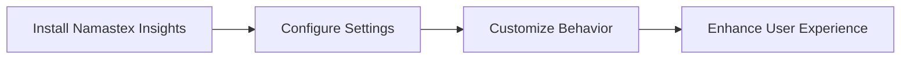

import { Callout, Steps, Step } from "nextra-theme-docs";

# Getting Started

Welcome to the Getting Started guide for Namastex Insights! In this section, we'll walk you through the process of setting up and integrating Namastex Insights into your Discord server. By the end of this guide, you'll have a fully functional AI-powered bot ready to engage and interact with your community.

<Callout type="info">
Before diving into the installation process, make sure you have the necessary [prerequisites](/getting-started/prerequisites) in place. This includes having a Discord server, the required permissions, and the necessary API keys.
</Callout>

## Installation

The installation process for Namastex Insights is straightforward and can be completed in just a few steps. Follow the detailed instructions in the [Installation](/getting-started/installation) subsection to get Namastex Insights up and running on your Discord server.

<Steps>
### Step 1

Clone the Namastex Insights repository from GitHub.

### Step 2

Install the required dependencies using your preferred package manager.

### Step 3

Set up the necessary environment variables, including your Discord bot token and API keys.

### Step 4

Run the bot and invite it to your Discord server.
</Steps>

## Configuration

Namastex Insights offers a range of configuration options to customize its behavior and tailor it to your specific needs. The [Configuration](/getting-started/configuration) subsection provides a comprehensive guide on modifying settings such as response styles, image generation parameters, and more.

By configuring Namastex Insights according to your preferences, you can create a unique and engaging experience for your Discord community.

<Callout type="success">
Once you've completed the installation and configuration steps, Namastex Insights will be ready to interact with your users and provide intelligent, personalized conversations. Get ready to unlock the power of AI-driven engagement!
</Callout>

## Next Steps

With Namastex Insights set up and configured, you're ready to explore its [Core Features](/core-features) and leverage its AI capabilities to enhance your Discord server. Here are some next steps to consider:

- Familiarize yourself with the [AI-Powered Personalization](/core-features/ai-powered-personalization) feature to understand how Namastex Insights adapts to individual user preferences.
- Explore the [Context Management](/core-features/context-management) system to see how Namastex Insights maintains coherent and relevant conversations.
- Discover the bot's [Intelligent Conversation](/core-features/intelligent-conversation) abilities and how it engages users in thoughtful discussions.
- Learn about the [Art Generation](/core-features/art-generation) feature and how users can create stunning visual content using Namastex Insights.

Get ready to embark on an exciting journey of AI-powered engagement and interaction with Namastex Insights!